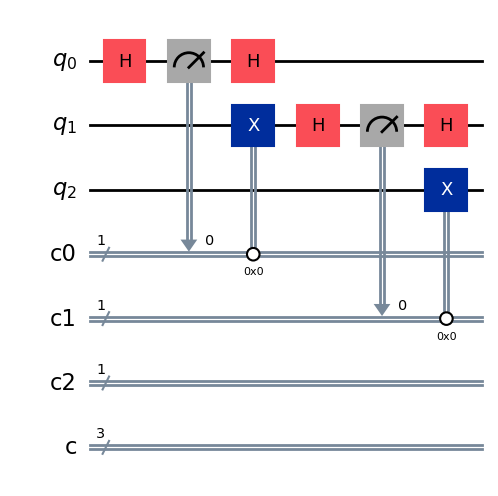

# Framework for reducing Mid-circuit Measurements and Resets in Dynamic Circuits
This project implements the method for reducing the number of mid-circuit measurements and resets in dynamic circuits proposet in the paper [Reducing Mid-Circuit Measurements via Probabilistic Circuits](https://arxiv.org/abs/2405.13747) and then extend it to a framework in the paper [*under review*](#).

## Usage
This framework takes as a file containing a quantum circuit written in QASM 2.0 format and gives as output a QASM file containing the optimized circuit.

### Running the framework
To run an instance of the framework, execute the following command from the `build` directory:
```
./qcprop_main <input_file_path> <output_file_path> <n_pcm>
```

The *n_pcm* parameter is a key control for the optimization process. It determines the balance between circuit synthesis complexity and optimization power. A higher *n_pcm* allows the framework to manage larger quantum states, reducing the number of mid-circuit measurements and resets.

### Format of the input file
The input file must follow a specific format. For each qubit 'i', a 1-bit classical register `creg ci[1]` must be defined. Each `ci` register acts as an ephemeral register to store the result of a mid-circuit measurement, which will be used to classically control other quantum operations, in other words, it is required for dynamic operations.
Only after defining these ephemeral registers should any additional classical registers for other operations (e.g., `creg c[n]`) be declared.  

Here it is an example of input file:
```qasm
OPENQASM 2.0;
include "qelib1.inc";

// Quantum registers
qreg q[3];

// Classical registers for classical controlled operations
creg c0[1]; // Register for qubit #0
creg c1[1]; // Register for qubit #1
creg c2[1]; // Register for qubit #2

// Classical registers for other operations
creg c[3];

h q[0];
measure q[0] -> c0[0];
if (c0 == 0) x q[1];
h q[0];

h q[1];
measure q[1] -> c1[0];
if (c1 == 0) x q[2];
h q[1];
```

This is a representation of the dynamic circuit:



## Quantum Constant Propagation
This project is based on an existing Quantum Constant Propagation (QCP) implementation and extends it by adding support for the Probabilistic Circuit Model, with the main goal of reducing the number of mid-circuit measurements and resets at compile time.

The QCP implementation is based  on the thesis [Efficient Implementation of Constant Propagation for Quantum Circuits](https://www.cs.cit.tum.de/fileadmin/w00cfj/pl/_my_direct_uploads/Efficient_Implementation_of_Constant_Propagation_for_Quantum_Circuits.pdf) whose implementation can be found in the repository: https://gitlab.lrz.de/theses/master-thesis-jakob-wt22.


